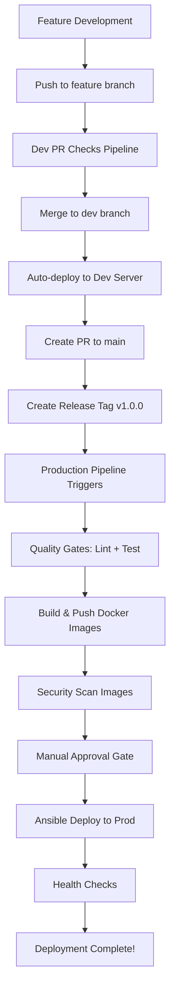

# Production Workflow Implementation Summary

## 🎉 What We've Built

You now have a **complete production deployment pipeline** that transforms your homelab project into an enterprise-grade CI/CD showcase!

## 📁 New Files Created

### 1. GitHub Actions Workflow
- **`.github/workflows/prod.yml`** - Tag-based production deployment with security scanning and manual approval

### 2. Production Infrastructure
- **`docker-compose.prod.yml`** - Production-optimized container orchestration with monitoring
- **`ansible/playbook/deploy-prod.yml`** - Automated production deployment with backups and health checks

### 3. Monitoring Stack
- **`monitoring/prometheus.yml`** - Metrics collection configuration
- **`monitoring/grafana/datasources/prometheus.yml`** - Grafana data source setup
- **`monitoring/grafana/dashboards/dashboard.yml`** - Dashboard provisioning

### 4. Documentation
- **`PRODUCTION.md`** - Comprehensive production deployment guide
- **`PRODUCTION-SUMMARY.md`** - This summary document

## 🔄 Complete Workflow Overview



## 🎯 Key Features Implemented

### Professional-Grade CI/CD
- ✅ **Tag-based releases** (v1.0.0 format)
- ✅ **Multi-environment deployment** (dev → prod)
- ✅ **Quality gates** (linting, testing, security)
- ✅ **Manual approval** for production safety
- ✅ **Automated rollback** capabilities

### Security & Reliability
- ✅ **Enhanced security scanning** (Trivy with SARIF reports)
- ✅ **Vulnerability management** (fail on HIGH/CRITICAL)
- ✅ **Pre-deployment backups** (database + files)
- ✅ **Health checks** and verification
- ✅ **Resource limits** and monitoring

### Infrastructure as Code
- ✅ **Ansible automation** for deployment
- ✅ **Docker Compose** for orchestration
- ✅ **Environment-specific configs** (dev vs prod)
- ✅ **Network isolation** and service discovery
- ✅ **Volume management** and persistence

### Monitoring & Observability
- ✅ **Prometheus metrics** collection
- ✅ **Grafana dashboards** (optional)
- ✅ **Container monitoring** (cAdvisor)
- ✅ **Application health checks**
- ✅ **Log aggregation** capabilities

## 🚀 Next Steps to Test

### 1. Set Up GitHub Secrets & Variables

**Secrets (Repository Settings > Secrets):**
```
PROD_SERVER_IP=your.production.ip
PROD_SERVER_USER=your_username
PROD_SSH_PRIVATE_KEY=your_private_key_content
PROD_MYSQL_ROOT_PASSWORD=secure_password
PROD_MYSQL_DATABASE=blogapp_prod
PROD_MYSQL_USER=blogapp_user
PROD_MYSQL_PASSWORD=secure_password
PROD_SECRET_KEY=your_jwt_secret_key
```

**Variables (Repository Settings > Variables):**
```
PROD_API_URL=https://blog.yourdomain.com
PROD_DOMAIN_NAME=blog.yourdomain.com
```

### 2. Create GitHub Environment

1. Go to **Settings > Environments**
2. Create `production` environment
3. Add protection rules:
   - Required reviewers: You
   - Deployment branches: `main` only

### 3. Prepare Production Server

```bash
# Install Docker
sudo apt update && sudo apt install docker.io docker-compose-plugin

# Create network and directories
docker network create blogapp_network
sudo mkdir -p /opt/blogapp-prod
sudo chown $USER:$USER /opt/blogapp-prod
```

### 4. Test the Production Pipeline

```bash
# 1. Ensure your code is on main branch
git checkout main
git pull origin main

# 2. Create and push a release tag
git tag v1.0.0
git push origin v1.0.0

# 3. Watch the GitHub Actions workflow
# Go to Actions tab in GitHub and monitor progress

# 4. Approve the production deployment when prompted

# 5. Verify deployment success
curl http://your-prod-server-ip/
```

## 📊 What This Demonstrates

This production workflow showcases **enterprise-level DevOps practices**:

### For Interviews & Portfolio
- **GitOps workflow** with proper branching strategy
- **Infrastructure as Code** with Ansible
- **Container orchestration** with Docker
- **Security-first approach** with vulnerability scanning
- **Monitoring & observability** with Prometheus/Grafana
- **Automated testing** and quality gates
- **Zero-downtime deployments** with health checks
- **Disaster recovery** with automated backups

### Technical Skills Demonstrated
- **CI/CD pipeline design** and implementation
- **Container security** and vulnerability management
- **Infrastructure automation** with Ansible
- **Monitoring stack** setup and configuration
- **Network design** and service discovery
- **Secret management** and security practices
- **Documentation** and operational procedures

## 🛟 Troubleshooting Quick Guide

### Common Issues & Solutions

**Pipeline fails at security scan:**
```bash
# Check for vulnerable dependencies
cd frontend && npm audit fix
cd backend && pip install --upgrade package-name
```

**Ansible connection fails:**
```bash
# Test SSH connection manually
ssh -i ~/.ssh/your_key user@your-server

# Verify SSH key in GitHub Secrets
cat ~/.ssh/your_key  # Should match GitHub secret
```

**Containers fail health checks:**
```bash
# Check logs on production server
docker logs blogapp-backend-prod
docker logs blogapp-nginx-prod

# Verify network connectivity
docker network inspect blogapp_network
```

### Support Commands

```bash
# View deployment status
cd /opt/blogapp-prod
docker compose ps

# Check container logs
docker compose logs -f

# View deployment info
cat deployment-info.json

# Manual container restart
docker compose restart service-name
```

## 🎯 Optional Enhancements

Want to take it further? Consider adding:

### Advanced Monitoring
- **ELK Stack** for log aggregation
- **Alertmanager** for alert routing
- **Uptime monitoring** with Uptime-Kuma

### Security Enhancements
- **Vault integration** for secret management
- **SIEM integration** for security monitoring
- **Regular security scanning** with Dependabot

### Performance & Scalability
- **Load testing** with K6 or Artillery
- **CDN integration** for static assets
- **Database replication** for high availability
- **Auto-scaling** with Docker Swarm or Kubernetes

---

## 🏆 Achievement Unlocked!

**You now have a production-ready CI/CD pipeline that rivals enterprise setups!**

This implementation demonstrates:
- ✅ **Professional DevOps practices**
- ✅ **Security-first mindset**  
- ✅ **Automation expertise**
- ✅ **Infrastructure skills**
- ✅ **Monitoring capabilities**
- ✅ **Documentation excellence**

Perfect for showcasing in your homelab portfolio and technical interviews! 🚀
